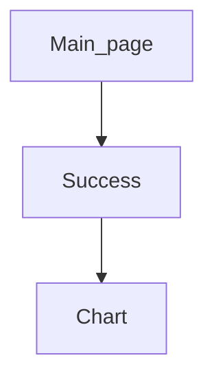

## Gender party 
### Система голосования 
:black_square_button:Мальчик    :black_square_button:Девочка 

**Запуск**
`python manage.py runserver`

#### Схема переходов

#### Главная страница
`http://127.0.0.1:8000/`
 
  На данной странице необходимо ввести свое имя и выбрать кандидата

  
  

#### После голосования
`http://127.0.0.1:8000/succeess`

После голосования вы попадаете на страницу где отображается ваше имя, и есть ссылка для просмотра графика

  

#### График

`http://127.0.0.1:8000/chart`

Данная страница отправляет ajax запрос в фоне на сервер, ответ изменяет график в реальном времени, по этому нет необходимости в перезагрузке страницы для получения новых данных

  

____

# Администраторская

**Результаты**

`http://127.0.0.1:8000/result`

Тут можно посмотреть кто голосовал так же можно удалить голоса (страница обновляется самостоятельно)

*Для удаления голоса нужно ввести pin 5828* 

  

